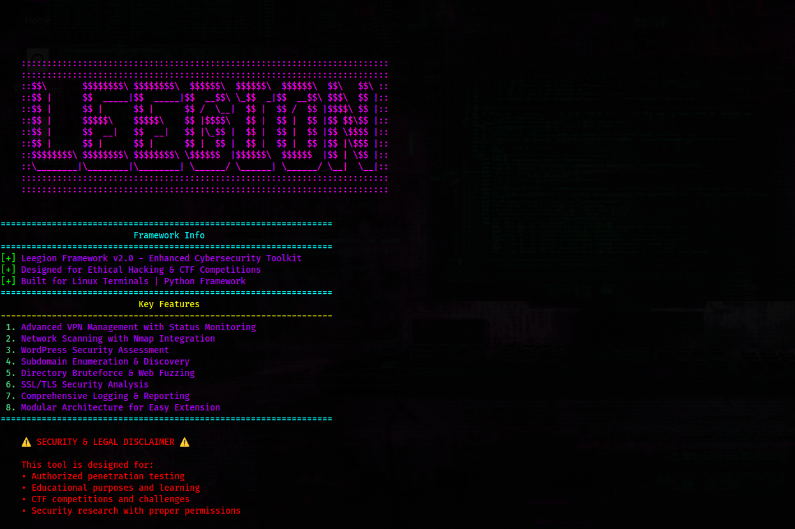
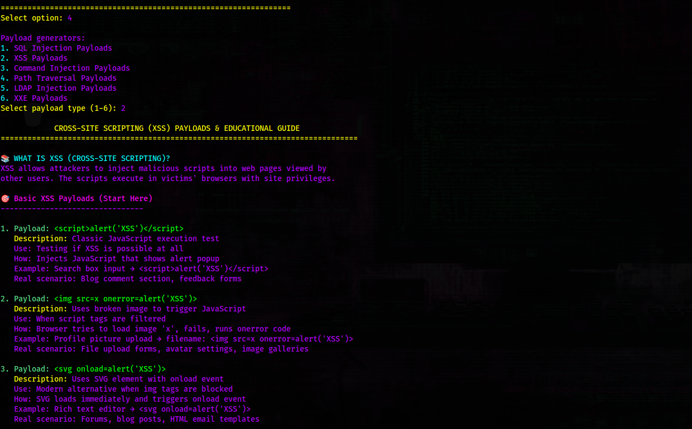
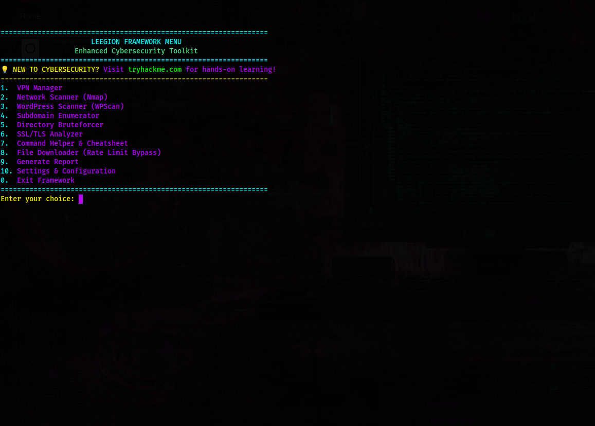
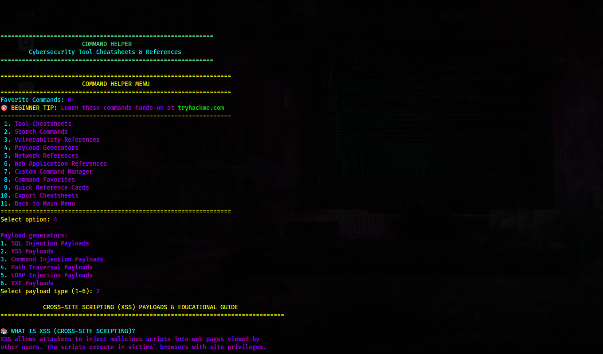

# Leegion Framework v2.0
## Enhanced Cybersecurity Toolkit for Ethical Hacking & Penetration Testing



**Author:** Leegion  
**License:** MIT License  
**Platform:** Linux  
**Copyright:** © 2025 Leegion. All rights reserved.

A comprehensive, modular cybersecurity framework designed for ethical hacking, penetration testing, CTF competitions, and security research. Built with a focus on educational value and practical application.

## 🌟 Key Features

### Core Modules
- **🔒 Advanced VPN Management** - OpenVPN integration with 3 display modes (Background, Live Monitor, Split View)
- **🌐 Network Scanner** - Nmap wrapper with multiple scan types and stealth options
- **📝 WordPress Scanner** - WPScan integration for CMS security assessment
- **🔍 Subdomain Enumerator** - Multi-technique subdomain discovery with DNS resolution
- **📂 Directory Bruteforcer** - Web directory and file discovery with custom wordlists
- **🔐 SSL/TLS Analyzer** - Certificate analysis and cipher testing with OpenSSL integration
- **📋 Command Helper** - Comprehensive cybersecurity tool cheatsheets with PDF export
- **📥 File Downloader** - Rate limit bypass for downloading security tools and resources
- **🐚 Reverse Shell Generator** - Multi-language reverse shell payloads with encoding and evasion

### Framework Features
- **🎓 Educational Focus** - Detailed explanations for beginners with real-world use cases
- **📊 Comprehensive Reporting** - SQLite database with multiple export formats
- **🎨 Professional Interface** - Clean terminal UI with proper navigation
- **⚙️ Modular Architecture** - Easy to extend and customize
- **📋 Enhanced Logging** - Colored output with file persistence
- **🚀 System Installation** - Install globally and run from anywhere with in-framework installer

### 🔐 Security Features
- **🛡️ Enhanced Input Validation** - Comprehensive security validation for all user inputs
- **🚦 Network Rate Limiting** - Automatic rate limiting for network operations (10 req/sec)
- **🔒 API Token Encryption** - Sensitive configuration data encrypted at rest
- **🛡️ Path Security** - Protection against path traversal and symlink attacks
- **🔐 Command Sanitization** - Safe subprocess execution with dangerous command filtering
- **🔍 Injection Pattern Detection** - Detection of SQL injection, XSS, and command injection patterns
- **🔐 Secure File Operations** - Safe filename generation and file path validation

## 🚀 Quick Start

### System-Wide Installation (Recommended)
```bash
# Quick install (one command)
sudo python3 leegion_manager.py install

# Or use Makefile
make install

# Run from anywhere
leegion
```

### Management Commands
```bash
# Interactive menu (recommended)
python3 leegion_manager.py

# Check installation status
python3 leegion_manager.py status

# Update framework
sudo python3 leegion_manager.py update

# Reinstall framework
sudo python3 leegion_manager.py reinstall

# Clean cache
sudo python3 leegion_manager.py clean

# Run tests
python3 leegion_manager.py test

# Show all options
python3 leegion_manager.py help
```

### Interactive Menu
The management script provides an interactive menu when run without arguments:
- **Real-time Status** - Shows current installation status
- **Easy Navigation** - Numbered options for all actions
- **Smart Validation** - Prevents invalid operations
- **Quick Access** - All management functions in one place

### Uninstallation
```bash
# Complete removal of the framework
sudo python3 leegion_manager.py uninstall

# Or use Makefile
make uninstall

# This will remove:
# - Framework files (/opt/leegion-framework)
# - Executable (/usr/local/bin/leegion)
# - User configuration (~/.config/leegion)
# - All logs, reports, and VPN configurations
```

### What the Uninstaller Does
The uninstaller provides a comprehensive cleanup process:
- **Process Management** - Stops any running Leegion processes
- **File Removal** - Completely removes all framework files and directories
- **System Cleanup** - Removes executable and user configurations
- **Cache Cleanup** - Cleans Python cache files and temporary data
- **Dependency Management** - Optionally removes system packages installed for Leegion
- **Verification** - Confirms complete removal of all components

### Local Setup
```bash
# Set up development environment
make dev-setup

# Run locally
python3 main.py
```

## 📖 Usage Examples

### Payload Generator Menu


### Main Framework Menu


### XSS Payloads Output


### Practical CTF Examples

#### **TryHackMe: Basic Pentesting**
```bash
# 1. Start framework and connect VPN
leegion
# Select: 1 (VPN Manager) → Load TryHackMe config → Background Mode

# 2. Network reconnaissance
# Select: 2 (Network Scanner) → Basic Host Discovery
# Enter target: 10.10.10.10

# 3. Port scanning
# Select: 2 (Network Scanner) → Port Scanning
# Enter target: 10.10.10.10
# Select: TCP SYN Scan

# 4. Web enumeration (if HTTP/HTTPS found)
# Select: 5 (Directory Bruteforcer)
# Enter URL: http://10.10.10.10
# Select: Common wordlist

# 5. WordPress assessment (if WordPress detected)
# Select: 3 (WordPress Scanner)
# Enter URL: http://10.10.10.10
# Select: Full scan
```

#### **HackTheBox: Web Application**
```bash
# 1. Initial scan
leegion
# Select: 2 (Network Scanner) → Comprehensive scan
# Target: 10.10.11.100

# 2. SSL/TLS analysis (if HTTPS)
# Select: 6 (SSL Analyzer)
# Enter: https://10.10.11.100

# 3. Directory bruteforcing
# Select: 5 (Directory Bruteforcer)
# URL: http://10.10.11.100
# Wordlist: dirb/common.txt

# 4. Generate reverse shell (if needed)
# Select: 9 (Reverse Shell Generator)
# Choose: PHP reverse shell
# Set: LHOST=10.10.14.50, LPORT=4444
```

#### **VulnHub: Privilege Escalation**
```bash
# 1. Service enumeration
leegion
# Select: 2 (Network Scanner) → Service Version Detection
# Target: 192.168.1.100

# 2. Web application testing
# Select: 5 (Directory Bruteforcer)
# URL: http://192.168.1.100
# Advanced options: Custom wordlist

# 3. Command reference
# Select: 7 (Command Helper)
# Category: Privilege Escalation
# Tool: LinPEAS, WinPEAS, etc.

# 4. Shell generation
# Select: 9 (Reverse Shell Generator)
# Language: Python
# Evasion: Base64 encoding
```

### VPN Management
```bash
# Framework provides three VPN connection modes:
# 1. Background Mode - Silent connection
# 2. Live Monitor Mode - Real-time output with timestamps  
# 3. Split View Mode - Side-by-side status and output display
```

### Network Scanning
```bash
# Multiple Nmap scan types with educational context:
# - Basic Host Discovery
# - Port Scanning (TCP/UDP)
# - Service Version Detection
# - OS Fingerprinting
# - Vulnerability Scanning
```

### Educational Resources
The framework includes comprehensive learning materials:
- **TryHackMe.com integration** - Direct links to hands-on labs
- **Detailed payload explanations** - Understanding what each tool does
- **Real-world scenarios** - When and how to use each technique
- **Safety guidelines** - Legal and ethical considerations
- **Reverse shell education** - Multi-language payloads with evasion techniques

## 🎯 Target Audience

- **Cybersecurity Students** - Learn through practical, hands-on experience
- **Penetration Testers** - Professional toolkit for security assessments
- **CTF Players** - Automated tools for capture-the-flag competitions
- **Security Researchers** - Comprehensive platform for vulnerability research
- **Ethical Hackers** - All-in-one framework for authorized security testing

## 🎯 CTF & Learning Platform Integration

### TryHackMe.com Usage
Leegion Framework is perfect for TryHackMe rooms and challenges:

#### **Getting Started with TryHackMe**
```bash
# 1. Connect to TryHackMe VPN
leegion
# Select VPN Manager → Load OpenVPN config → Connect in Background Mode

# 2. Use Network Scanner for initial reconnaissance
# Select Network Scanner → Basic Host Discovery → Enter target IP

# 3. Use Directory Bruteforcer for web enumeration
# Select Directory Bruteforcer → Enter target URL → Start enumeration

# 4. Use WordPress Scanner for CMS assessment
# Select WordPress Scanner → Enter target URL → Full scan
```

#### **Recommended TryHackMe Workflow**
1. **VPN Connection**: Always connect to TryHackMe VPN first
2. **Host Discovery**: Use Network Scanner to find live hosts
3. **Port Scanning**: Identify open services and potential attack vectors
4. **Web Enumeration**: Use Directory Bruteforcer for hidden files/directories
5. **Service Assessment**: Use appropriate scanners (WordPress, SSL, etc.)
6. **Payload Generation**: Use Reverse Shell Generator for exploitation
7. **Documentation**: Use Command Helper for tool references

#### **TryHackMe Room Types & Tools**
- **Web Application Rooms**: Directory Bruteforcer, WordPress Scanner, SSL Analyzer
- **Network Rooms**: Network Scanner, VPN Manager
- **Privilege Escalation**: Command Helper, Reverse Shell Generator
- **CTF Challenges**: All modules for comprehensive enumeration

### HackTheBox.com Usage
Perfect for HackTheBox machines and challenges:

#### **HTB Machine Methodology**
```bash
# 1. Connect to HTB VPN (if required)
leegion
# VPN Manager → Load HTB OpenVPN config

# 2. Initial reconnaissance
# Network Scanner → Comprehensive scan of target IP

# 3. Service enumeration
# Use appropriate scanners based on discovered services

# 4. Web application testing
# Directory Bruteforcer + WordPress Scanner for web services

# 5. Exploitation preparation
# Reverse Shell Generator → Create payloads for discovered services
```

#### **HTB Challenge Workflow**
1. **Target Analysis**: Use Network Scanner for initial footprinting
2. **Service Enumeration**: Identify and analyze all open services
3. **Web Assessment**: If web services found, use web enumeration tools
4. **Vulnerability Research**: Use Command Helper for tool references
5. **Exploitation**: Generate appropriate payloads with Reverse Shell Generator
6. **Post-Exploitation**: Document findings and maintain access

### Other Learning Platforms

#### **VulnHub**
- Use Network Scanner for VM discovery
- Directory Bruteforcer for web enumeration
- WordPress Scanner for CMS vulnerabilities
- SSL Analyzer for certificate analysis

#### **Portswigger Web Security Academy**
- Directory Bruteforcer for hidden endpoints
- SSL Analyzer for HTTPS configuration
- Command Helper for Burp Suite references

#### **OverTheWire**
- Network Scanner for host discovery
- Directory Bruteforcer for web challenges
- Reverse Shell Generator for exploitation

## 📚 Educational Integration

### Beginner-Friendly Features
- **Step-by-step guides** for each security technique
- **Real-world use cases** showing practical applications
- **Safety warnings** and legal compliance information
- **Platform-specific workflows** for TryHackMe, HackTheBox, and more
- **Detailed explanations** of what each payload/command does

### Advanced Features
- **Custom payload creation** and modification
- **Advanced evasion techniques** for sophisticated testing
- **Integration capabilities** with external security tools
- **Comprehensive reporting** for professional assessments
- **Platform-specific optimizations** for different learning environments

## 🛠️ Module Documentation

### VPN Manager
- OpenVPN configuration management
- Connection status monitoring with IP detection
- Multiple display modes for different use cases
- External VPN detection and tracking

### Network Scanner (Nmap)
- Host discovery and port scanning
- Service enumeration and OS detection
- Vulnerability scanning integration
- Custom scan configurations

### WordPress Scanner
- Theme and plugin vulnerability detection
- User enumeration and brute forcing
- Security misconfigurations identification
- Automated reporting

### SSL/TLS Analyzer
- Certificate validation and analysis
- Cipher suite testing and recommendations
- Protocol vulnerability detection
- Compliance checking

### Reverse Shell Generator
- Multi-language reverse shell payloads (Bash, Python, PowerShell, PHP, Perl, Ruby, Java, Go, Lua, Node.js)
- Payload encoding and evasion techniques
- Listener setup commands and configurations
- Custom payload creation and management
- Educational resources and safety guidelines

## 🔧 Configuration

The framework uses JSON-based configuration with runtime updates:
```json
{
    "log_level": "INFO",
    "vpn_config_dir": "vpn_configs",
    "output_dir": "reports",
    "database_path": "reports/leegion.db"
}
```

## 📊 Reporting

- **SQLite Database** - Lightweight, portable result storage
- **Multiple Formats** - JSON, XML, CSV export options
- **Historical Tracking** - Scan result archival and comparison
- **Professional Reports** - Formatted output for client delivery

## ⚖️ Legal Disclaimer

This framework is designed for:
- ✅ Authorized penetration testing
- ✅ Educational purposes and learning  
- ✅ CTF competitions and challenges
- ✅ Security research with proper permissions

**DO NOT USE FOR:**
- ❌ Unauthorized access to systems
- ❌ Illegal activities or malicious purposes
- ❌ Testing systems without explicit permission

Users are responsible for ensuring compliance with all applicable laws and regulations.

## 🔐 Security & Safety

### CTF & Learning Platform Best Practices

#### **General Tips for Learning Platforms**
1. **Always Use VPN**: Connect to platform VPN before any scanning
2. **Start Small**: Begin with basic scans before comprehensive enumeration
3. **Document Everything**: Use Command Helper to record useful commands
4. **Rate Limiting**: Respect platform rate limits to avoid being blocked
5. **Legal Compliance**: Only test authorized targets on learning platforms

#### **Platform-Specific Guidelines**

**TryHackMe**
- Use Background VPN mode for stable connections
- Start with Network Scanner for host discovery
- Use Directory Bruteforcer with common wordlists first
- Enable WPScan API token for WordPress rooms
- Save scan results for room documentation

**HackTheBox**
- Use comprehensive network scans for initial enumeration
- Focus on service version detection for exploitation
- Use SSL Analyzer for HTTPS services
- Generate platform-specific reverse shells
- Document findings for machine writeups

**VulnHub**
- Use aggressive scanning for local VMs
- Focus on web application enumeration
- Use custom wordlists for specific challenges
- Generate multiple shell payloads for testing

### Built-in Security Features

#### Input Validation & Sanitization
- **Comprehensive Validation**: All user inputs are validated for type, format, and security
- **Injection Protection**: Automatic detection of SQL injection, XSS, and command injection patterns
- **Path Security**: Protection against path traversal attacks and unsafe file operations
- **Command Sanitization**: Dangerous commands are filtered from subprocess executions

#### Network Rate Limiting
- **Automatic Throttling**: Network requests are automatically rate-limited to 10 requests per second
- **Thread-Safe**: Rate limiting works across all concurrent operations
- **Module Integration**: Applied to directory bruteforcing, SSL analysis, and VPN IP checks
- **Configurable**: Rate limits can be adjusted in the security configuration

#### API Token Security
- **Encryption at Rest**: API tokens (e.g., WPScan) are encrypted when stored in configuration
- **Transparent Access**: Tokens are automatically decrypted when needed by modules
- **Secure Storage**: Uses industry-standard encryption with secure key management
- **Zero Configuration**: Works automatically without user intervention

### Troubleshooting

#### Common Issues

**Rate Limiting Too Aggressive**
```bash
# If scans are too slow, you can temporarily disable rate limiting
# Edit core/security.py and change the network_rate_limiter parameters
network_rate_limiter = InMemoryRateLimiter(max_calls=20, period=1.0)  # 20 req/sec
```

**API Token Not Working**
```bash
# If WPScan API token isn't working:
# 1. Check if token is valid at https://wpscan.com/api
# 2. Clear and re-enter the token in the configuration
# 3. Restart the framework
```

**Permission Denied Errors**
```bash
# For file access issues:
# 1. Ensure you're running with appropriate permissions
# 2. Check that target directories are accessible
# 3. Verify file paths don't contain dangerous characters
```

**Network Connection Issues**
```bash
# If network operations fail:
# 1. Check your internet connection
# 2. Verify firewall settings aren't blocking requests
# 3. Try reducing scan intensity or target scope
```

#### Security Best Practices

1. **Always Use VPN**: Enable VPN before performing any network reconnaissance
2. **Validate Targets**: Only scan systems you own or have explicit permission to test
3. **Monitor Logs**: Check framework logs for any security warnings or errors
4. **Update Regularly**: Keep the framework updated for the latest security patches
5. **Secure Configuration**: Store sensitive configuration in secure locations

#### Performance Optimization

- **Rate Limiting**: Adjust rate limits based on target system capacity
- **Thread Count**: Modify `max_threads` in configuration for your system
- **Timeout Settings**: Increase timeouts for slow networks or large scans
- **Memory Usage**: Monitor memory usage during intensive operations

## 🤝 Contributing

Contributions are welcome! Please feel free to submit pull requests, report issues, or suggest new features.

1. Fork the repository
2. Create a feature branch
3. Make your changes
4. Add tests if applicable
5. Submit a pull request

## 📜 License

This project is licensed under the MIT License - see the [LICENSE](LICENSE) file for details.

## 🙏 Acknowledgments

- **TryHackMe.com** - Excellent platform for cybersecurity education and hands-on learning
- **HackTheBox.com** - Professional penetration testing challenges and skill development
- **VulnHub** - Vulnerable machine resources for practical security testing
- **Offensive Security** - Inspiration for professional penetration testing tools
- **The cybersecurity community** - For continuous learning and knowledge sharing

## 📞 Support

- **Issues**: Report bugs and request features via GitHub Issues
- **Documentation**: Comprehensive guides included in each module
- **Community**: Join discussions and share experiences

---

**Remember**: Use this framework responsibly and only for authorized security testing. Happy ethical hacking! 🔒